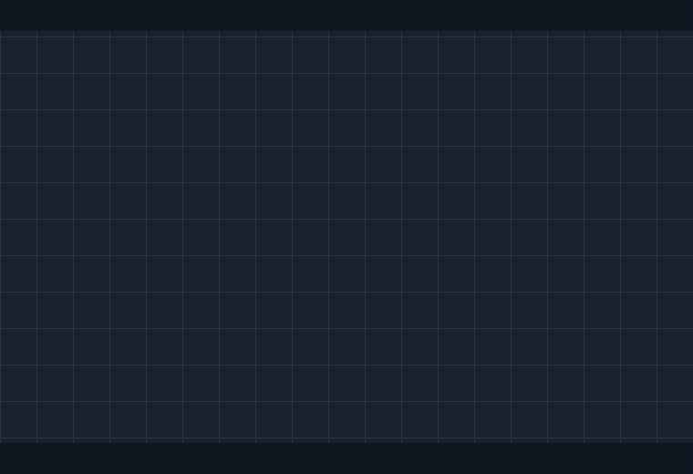

# Foxy Overlay

[](https://github.com/alik-r/foxy-overlay/actions/workflows/ci.yml)
[](https://dotnet.microsoft.com/download/dotnet/8.0)
[](#install)

A desktop port of the [Foxy Jumpscare Terraria mod](https://steamcommunity.com/workshop/filedetails/?id=3525193051):
every second, it rolls a one-in-ten-thousand chance, and when the dice come up Foxy
he lunges out of your screen, transparently, over whatever you happen to be doing.



---

## Install

Grab a zip from [Releases](https://github.com/alik-r/foxy-overlay/releases), unzip it
somewhere permanent, and run `FoxyOverlay.exe`.

- **`...-win-x64-selfcontained.zip`**: no prerequisites, larger download.
- **`...-win-x64.zip`**: smaller, needs the [.NET 8 Desktop Runtime](https://dotnet.microsoft.com/download/dotnet/8.0).

There is no installer and no visible window. The app sits in the notification area;
right-click its icon for **Settings**, **Trigger now**, **Pause** and **Exit**.
"Start with Windows" in settings writes a single `HKCU` Run-key entry: no admin
rights, no service, nothing else touched.

---

## Configuration

Settings live in `%AppData%\FoxyOverlay\config.json` and are editable from the tray.
Out-of-range values are clamped on load and the correction is logged, so a hand-edited
file can never stop the app from starting.

| Setting | Default | Meaning |
| --- | --- | --- |
| `ChanceX` | `10000` | One-in-`ChanceX` odds, rolled once per second. Min 2, max 100,000,000. |
| `CooldownSeconds` | `3` | Quiet period after a scare before rolling resumes. |
| `PackPath` | `null` | A baked pack folder, or a green-screen video to bake. `null` uses the bundled Foxy. |
| `IsMuted` | `false` | Skip the audio track. |
| `Enabled` | `true` | Master switch. |
| `AllMonitors` | `true` | Show on every monitor, or just the primary. |
| `HeightFraction` | `0.85` | Overlay height as a fraction of screen height. |
| `StartWithWindows` | `false` | Mirrors the `HKCU` Run-key entry. |

At the default odds a jumpscare is 99% likely within about **12 hours 47 minutes** of
uptime, and averages one every ~2 hours 47 minutes. The settings window works this out
for whatever odds you type.

Also in `%AppData%\FoxyOverlay\`:

- `app.log` — rotates at 1 MB, keeps 3 archives.
- `stats.json` — lifetime scare and roll counts, flushed once a minute.
- `packs/` — packs baked from your own videos, cached by source path and timestamp.

---

## Using your own video

The source needs a **solid green background** (the bundled clip keys `#00FE00`).

**From the tray:** Settings → Video → Browse, pick a video, Save. It is baked on first
use into `%AppData%\FoxyOverlay\packs\` — this needs `ffmpeg` on `PATH`. The settings
window tells you if it cannot find one.

**Ahead of time**, which needs no ffmpeg on the target machine:

```bash
scripts/bake.sh my-clip.mp4 ./my-pack            # defaults: chromakey 0x00FE00:0.12:0.06
scripts/bake.sh my-clip.mp4 ./my-pack 0x00FF00 0.18 0.08   # key, similarity, blend
```

Then point `PackPath` at `./my-pack`. A pack is just a folder:

```
my-pack/
  pack.json          width, height, frameCount, frameRate, framePattern, audioFile
  frame_000.png ...  RGBA frames, keyed
  audio.wav          16-bit PCM (SoundPlayer accepts nothing else)
```

---

## Building

**You do not need Windows to build this**, only to run it. `EnableWindowsTargeting` in
`Directory.Build.props` lets the `net8.0-windows` WPF project restore and compile on
Linux and macOS; the XAML markup compiler is managed code and runs anywhere. Only the
final `.exe` apphost is platform-specific.

```bash
dotnet build                    # everything, including the WPF app, on any OS
dotnet test                     # Core and Services suites (no display needed)
dotnet publish FoxyOverlay.Media/FoxyOverlay.Media.csproj \
  -c Release -r win-x64 --self-contained false -o out    # produces FoxyOverlay.exe
```

CI builds and tests on both `ubuntu-latest` and `windows-latest` for exactly this reason.
See [docs/BUILDING.md](docs/BUILDING.md) for developing from WSL against a Windows host.

---

## Project layout

```
FoxyOverlay.Core/         net8.0     config, logging, stats, pack loading and baking,
                                     probability and overlay geometry — no UI, no Windows
FoxyOverlay.Services/     net8.0     JumpscareService: the once-a-second roll loop
FoxyOverlay.Media/        net8.0-win WPF tray app, layered overlay window, frame player
assets/source/foxy.mp4               the original green-screen clip
assets/foxy/                         the baked pack, shipped with the app
scripts/bake.sh                      the asset pipeline
```

---

## Limitations

- **Windows only.** Layered click-through windows and the tray icon are Win32.
- **Not visible over exclusive-fullscreen games.** A topmost layered window cannot draw
  over an exclusive-fullscreen swap chain. Borderless-windowed mode works fine.
- **~285 MB** while idle, most of it decoded frames.
- **Baking your own video needs ffmpeg**; the bundled pack does not.

---

## Licence

MIT. The Foxy character and the source clip belong to their respective owners; this
repository is a port of a mod and claims nothing over them.
